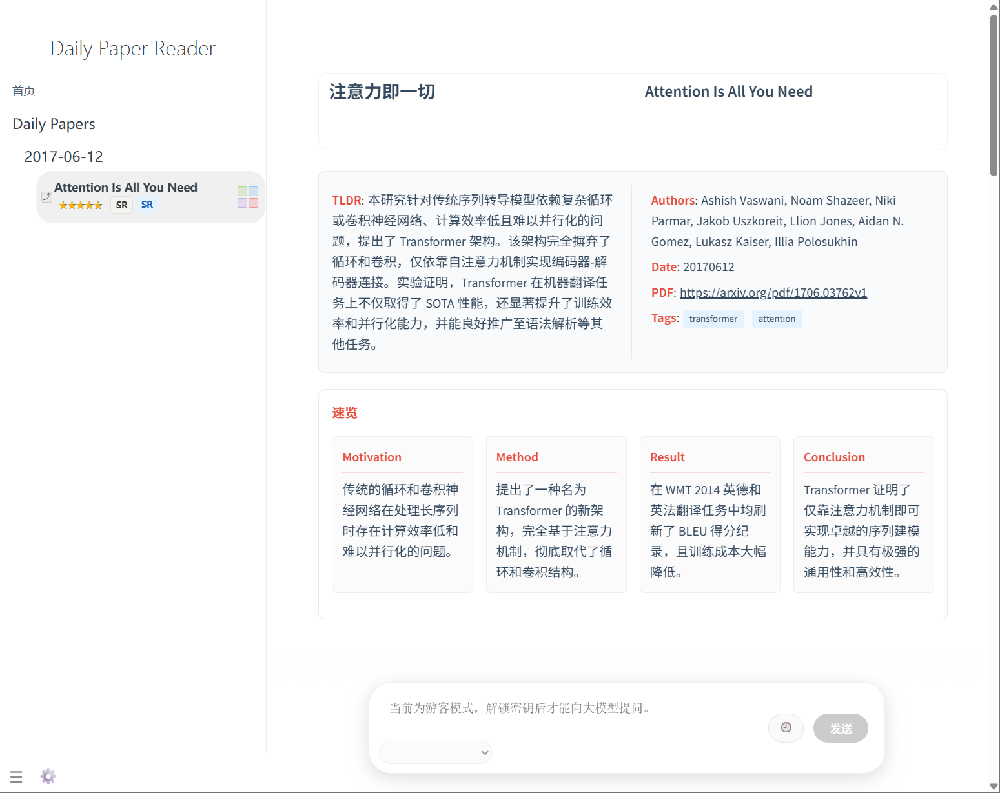

# Daily Paper Reader（免费 / 开源 / Fork即用）

> 一个智能的 arXiv / openreview 论文推荐系统
\
Fork 后每天自动抓取论文、推荐论文。
\
每日平均成本￥0.2。

## 你能快速得到什么

- 每天自动更新个性化论文推荐平台
- 可按关键词/意图筛选的推荐流
- 随时提问的gemini-3 论文阅读小助手
- 5 分钟搭建，无额外成本

示例： https://ziwenhahaha.github.io/daily-paper-reader

## 5 分钟快速启动

### 1. 提前准备两个密钥

#### 1.1 获取大模型密钥

> 不是柏拉图行不行？对比了市面上的集成平台，柏拉图是性价比最高的，柏拉图平台上有按0.001元/次的reranker模型调用，和非常便宜的gemini3 flash模型: 提示¥0.5/M tokens 补全 ¥3/M tokens，建议还是配这个，每天花费1~3毛钱。

- 打开 **柏拉图 API 平台** [https://api.bltcy.ai/](https://api.bltcy.ai/) 完成注册/登录
- 充值 5 元
- 新建密钥

#### 1.2 获取 Github 访问许可 
- 打开 [GitHub 新建 PAT 页面](https://github.com/settings/tokens/new?type=beta&scopes=repo,workflow,gist) 
- 勾选 **这三项权限**（上面链接已预勾选）：
  - `repo`
  - `workflow`
  - `gist`

### 2. Fork 本仓库 （第二步往后的操作均需要在自己仓库中点击）
Fork 该仓库到自己账号下，建议仓库名字保持原样。

### 3. 开启 Actions
进入 Fork 的仓库 → 页面上方点 `Actions` → 左边 `daily-paper-reader` 开启

### 4. 开启 GitHub Pages
- GitHub Pages 设置 点击此链接[../../settings/pages](../../settings/pages)  或者 依次点击 `Settings → Pages → Source`
- 
- 选 `Deploy from a branch`，分支 `main`，目录 `/(root)`，保存
- 静候1分钟，站点地址会显示在页面顶部

### 5. 打开站点验收
访问 `https://<你的用户名>.github.io/<仓库名>/`

此后所有操作均在网页端执行

## 版本迭代（请持续更新）

| 版本 | 日期 | 更新内容 |
| --- | --- | --- |
| v1.0.0 | 2026-02-19 | 基础功能实现完成 |
| Unreleased | - | 请在每次发布时补充 |

## Star 曲线（项目热度）

